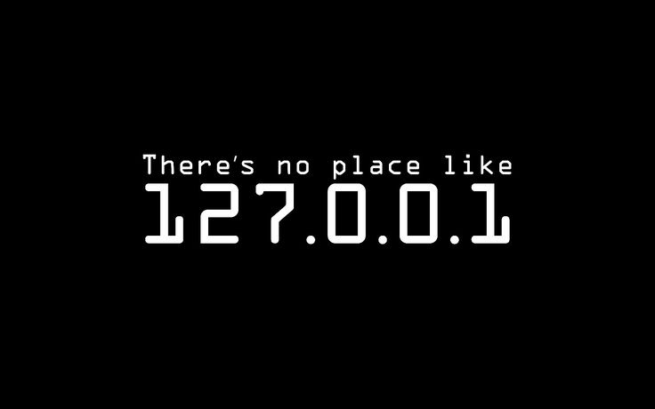

  

  
  
  
  

 

<h2 align="center"> <em>About Me</em></h2>

 

  Hello There! <em><b>I'm Yogesh Kumar</b></em>, a passionate Full Stack Developer and UI/UX Designer from Haryana, India.
  
  I enjoy building modern and scalable applications using MERN Stack, Next.js, Supabase, and modern cloud technologies. I also love designing clean and user-friendly interfaces using Figma and Canva.
  
  I have experience working on real-world production projects including car care platforms, educational platforms, skincare brands, inventory systems, and full-stack e-commerce solutions.

 

   <em><b> Full Stack Developer</b></em> 
   <em><b> UI/UX Designer</b></em> 
   <em><b> Passionate About Modern Web Technologies</b></em> 
   <em><b> Learning AI Tools, Cloud & Scalable Systems</b></em> 

 
 

<h2 align="center"> <em>Technologies & Skills</em> </h2>

  
  
  
  
  
  
  
  
  
  
  
  
  
  
  
  
  
  
  
  
  

 

<h2 align="center"> <em>Quote</em> </h2>

  <em>"Design. Develop. Improve. Repeat."</em>

